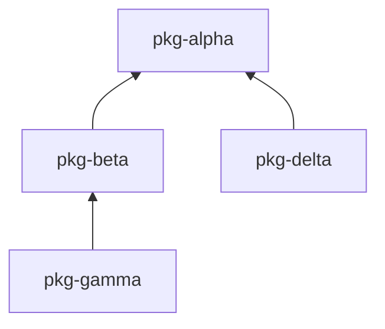

# uv-release-monorepo

Push-button releases for [uv](https://github.com/astral-sh/uv) monorepos. Rebuilds only what changed, creates one GitHub release per package, handles version bumping.

## Quick Start

```bash
uv tool install uv-release-monorepo
uvr init        # generate .github/workflows/release.yml
uvr release     # detect changes, show plan, dispatch to CI
```

## Releasing

```bash
# Preview what would be released
uvr status

# Release to CI (default)
uvr release

# Release locally (pure-python packages only)
uvr release --where local
```

### Release types

```bash
uvr release              # final: 1.0.1.dev0 → 1.0.1
uvr release --dev        # dev:   publish 1.0.1.dev0 as-is
uvr release --pre a      # alpha: 1.0.1.dev0 → 1.0.1a0
uvr release --pre rc     # rc:    1.0.1.dev0 → 1.0.1rc0
uvr release --post       # post:  1.0.1 → 1.0.1.post0
```

### Skipping and reusing

```bash
uvr release --skip build                      # skip the build job
uvr release --skip-to publish                 # skip everything before publish
uvr release --skip build --reuse-run 12345    # reuse artifacts from run 12345
```

## Managing runners

```bash
uvr runners                        # show all package runners
uvr runners my-pkg --add macos-14  # add a build runner
uvr runners my-pkg --clear         # reset to default (ubuntu-latest)
```

## Installing from releases

```bash
uvr install myorg/myrepo/my-pkg           # latest release
uvr install myorg/myrepo/my-pkg@1.2.3     # specific version
```

## How it works

`uvr release` scans your workspace, diffs each package against its last baseline tag, walks the dependency graph, and builds a plan containing every shell command needed for the release. It dispatches this plan to GitHub Actions, which runs seven jobs:

```
pre-build → build → post-build → pre-release → publish → finalize → post-release
```

Hook jobs (pre-build, post-build, pre-release, post-release) are no-ops by default — edit `release.yml` directly to add tests, linting, PyPI publish, or notifications.

## Documentation

- **[User Guide](../../docs/user-guide/README.md)** — setup, releasing, hooks, PyPI, skip/reuse, package filtering
- **[Under the Hood](../../docs/under-the-hood/README.md)** — change detection, dependency pinning, build matrix, workflow model

## Repository Structure

This repo is itself a uv workspace monorepo with dummy packages for testing:

```
uv-release-monorepo/
├── packages/
│   ├── uv-release-monorepo/  # The actual CLI tool (published to PyPI)
│   ├── pkg-alpha/             # Dummy: no dependencies
│   ├── pkg-beta/              # Dummy: depends on alpha
│   ├── pkg-delta/             # Dummy: depends on alpha (sibling of beta)
│   └── pkg-gamma/             # Dummy: depends on beta
└── pyproject.toml             # Workspace root
```

### Dependency Graph



This structure tests:
- **Leaf changes** — Changing `pkg-gamma` rebuilds only gamma
- **Root changes** — Changing `pkg-alpha` cascades to alpha, beta, delta, gamma
- **Sibling isolation** — Changing `pkg-delta` doesn't affect gamma (different branch)
- **Middle changes** — Changing `pkg-beta` rebuilds beta and gamma
