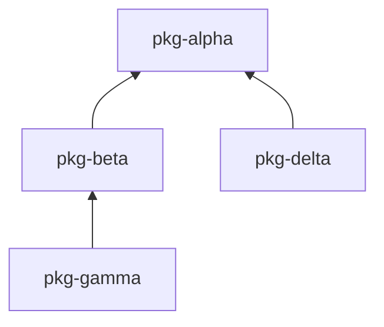

# uv-release-monorepo

Push-button releases for your [uv](https://github.com/astral-sh/uv) multi-package monorepo. It rebuilds only the packages that changed, creates one GitHub release per package, and handles version bumping automatically. You own major.minor; CI owns patch.

## Why

Releasing from a monorepo is tedious. You have to figure out which packages actually changed, build the right ones, tag them, bump versions, and publish — without forgetting a transitive dependent three levels deep. Multiply that by a matrix of OS runners and it stops being something you do by hand.

uvr turns the whole thing into one command. It diffs against the last release, walks the dependency graph, builds a plan, and hands it to GitHub Actions. Unchanged packages keep their existing wheels. You stay in control of major and minor versions; CI owns the patch number.

## Quick Start

```bash
uv tool install uv-release-monorepo   # install the CLI
uvr init                               # generate .github/workflows/release.yml
uvr release                            # detect changes → print plan → confirm → dispatch
```

You need [uv](https://github.com/astral-sh/uv), a GitHub repo with Actions enabled, a `pyproject.toml` with `[tool.uv.workspace]` members defined, and the [GitHub CLI](https://cli.github.com/) (`gh`) if you want to dispatch from the terminal.

## What You Can Do

### Release only what changed

```bash
uvr release              # print plan, prompt before dispatching
uvr release -y           # skip prompt, dispatch immediately
uvr release --rebuild-all  # rebuild everything regardless of changes
```

uvr scans your workspace, diffs each package against its last dev baseline tag, and builds only what's new — plus anything downstream in the dependency graph. By default, `uvr release` prints the plan as JSON and asks for confirmation before dispatching via `gh`.

### Filter packages

Add `[tool.uvr.config]` to your workspace root `pyproject.toml` to control which packages uvr manages:

```toml
[tool.uvr.config]
include = ["pkg-alpha", "pkg-beta"]   # only these packages (allowlist)
exclude = ["pkg-internal"]            # skip these packages (denylist)
```

If `include` is set, only listed packages are considered. `exclude` filters out from whatever remains. Both are optional.

### Build for multiple architectures

```bash
uvr init -m my-native-pkg ubuntu-latest macos-14
```

Each `-m` assigns one or more GitHub Actions runners to a package. Re-run `uvr init` to update runners; existing entries are preserved.

### Run tests or lints in CI

Hooks let you inject steps at four points in the release pipeline: `pre-build`, `post-build`, `pre-release`, and `post-release`.

```bash
uvr hooks pre-build add --name "Run tests" --run "uv run pytest"
```

Every hook job has access to `$UVR_PLAN` (the full release plan JSON) and `$UVR_CHANGED` (space-separated list of changed packages). See the [full guide](docs/guide.md) for all hook operations.

### Edit workflow settings

`uvr workflow` reads, writes, and deletes any key in `release.yml`:

```bash
uvr workflow permissions                          # read
uvr workflow permissions id-token --set write     # write
uvr workflow permissions id-token --clear         # delete
uvr workflow jobs post-release environment --set pypi  # nested write
```

List operations:

```bash
uvr workflow jobs build tags --add release         # append
uvr workflow jobs build tags --insert v2 --at 0    # insert at position
uvr workflow jobs build tags --remove release      # remove by value
```

Edits are validated against the workflow schema before writing — unknown job names or invalid structures are rejected.

### Example: full CI pipeline setup

Starting from a fresh `uvr init`, add pre-build checks and a post-release PyPI publish:

```bash
# Gate releases on lint + tests
uvr hooks pre-build add --id setup-uv \
  --name "Set up uv and Python" \
  --uses astral-sh/setup-uv@v5 \
  --with 'python-version=${{ fromJSON(inputs.plan).python_version }}'

uvr hooks pre-build add --id check \
  --name "Lint, typecheck, and test" \
  --run 'uv sync --all-packages
uv run poe check
uv run poe test'

# Publish to PyPI after release (only when uv-release-monorepo changed)
uvr hooks post-release add --id pypi-download \
  --name "Download wheel for PyPI" \
  --if "fromJSON(inputs.plan).changed['uv-release-monorepo'] != null" \
  --run 'VERSION=$(echo "$UVR_PLAN" | python3 -c "import sys,json; p=json.load(sys.stdin); print(p[\"changed\"][\"uv-release-monorepo\"][\"version\"])")
TAG="uv-release-monorepo/v${VERSION}"
mkdir -p dist
gh release download "$TAG" --repo "${{ github.repository }}" --pattern "uv_release_monorepo-*.whl" --dir dist'

uvr hooks post-release add --id pypi-publish \
  --name "Publish to PyPI" \
  --if "fromJSON(inputs.plan).changed['uv-release-monorepo'] != null" \
  --uses pypa/gh-action-pypi-publish@release/v1

# Set workflow permissions and job environment for trusted publishing
uvr workflow permissions id-token --set write
uvr workflow jobs post-release environment --set pypi
```

### Install packages from GitHub releases

```bash
uvr install my-package           # latest version, resolves internal deps
uvr install my-package@1.2.3     # pinned version
uvr install acme/other-repo/pkg  # from another repository
```

This resolves the full dependency graph, downloads the appropriate wheels, and installs them with `uv pip install`.

### Check your configuration

```bash
uvr status
```

## How It Works

`uvr release` runs on your machine. It scans the workspace, detects which packages changed since their last dev baseline tag, precomputes release notes, expands the build matrix, and serializes a `ReleasePlan` JSON. After you confirm, that plan is dispatched to GitHub Actions — the workflow is a pure executor that makes no decisions of its own.

On CI, three jobs run in sequence:

1. **build** — A matrix job builds each changed package on its configured runners and uploads wheels as artifacts.
2. **publish** — A matrix job creates one GitHub release per changed package using `softprops/action-gh-release`, attaching the built wheels.
3. **finalize** — Bumps patch versions, commits, tags dev baselines, and pushes.

For the full internals — tag structure, version bumping, CI hooks — see the [guide](docs/guide.md).

## Repository Structure

This repo is itself a uv workspace monorepo with dummy packages for testing:

```
uv-release-monorepo/
├── packages/
│   ├── uv-release-monorepo/  # The actual CLI tool (published to PyPI)
│   ├── pkg-alpha/             # Dummy: no dependencies
│   ├── pkg-beta/              # Dummy: depends on alpha
│   ├── pkg-delta/             # Dummy: depends on alpha (sibling of beta)
│   └── pkg-gamma/             # Dummy: depends on beta
└── pyproject.toml             # Workspace root
```

### Dependency Graph



This structure tests:
- **Leaf changes** — Changing `pkg-gamma` rebuilds only gamma
- **Root changes** — Changing `pkg-alpha` cascades to alpha, beta, delta, gamma
- **Sibling isolation** — Changing `pkg-delta` doesn't affect gamma (different branch)
- **Middle changes** — Changing `pkg-beta` rebuilds beta and gamma
