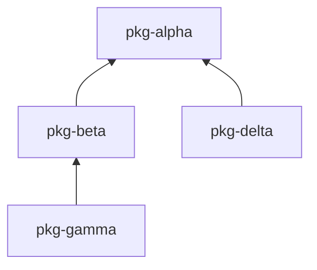

# uv-release-monorepo

Push-button releases for your [uv](https://github.com/astral-sh/uv) multi-package monorepo. It rebuilds only the packages that changed, creates one GitHub release per package, and handles version bumping automatically. You own major.minor; CI owns patch.

## Why

Releasing from a monorepo is tedious. You have to figure out which packages actually changed, build the right ones, tag them, bump versions, and publish — without forgetting a transitive dependent three levels deep. Multiply that by a matrix of OS runners and it stops being something you do by hand.

uvr turns the whole thing into one command. It diffs against the last release, walks the dependency graph, builds a plan, and hands it to GitHub Actions. Unchanged packages keep their existing wheels. You stay in control of major and minor versions; CI owns the patch number.

## Quick Start

```bash
uv tool install uv-release-monorepo   # install the CLI
uvr init                               # generate .github/workflows/release.yml
uvr release                            # detect changes -> print plan -> confirm -> dispatch
```

You need [uv](https://github.com/astral-sh/uv), a GitHub repo with Actions enabled, a `pyproject.toml` with `[tool.uv.workspace]` members defined, and the [GitHub CLI](https://cli.github.com/) (`gh`) if you want to dispatch from the terminal.

## What You Can Do

### Release only what changed

```bash
uvr release              # print plan, prompt before dispatching
uvr release -y           # skip prompt, dispatch immediately
uvr release --rebuild-all  # rebuild everything regardless of changes
```

uvr scans your workspace, diffs each package against its last dev baseline tag, and builds only what's new — plus anything downstream in the dependency graph. `uvr release` prints a human-readable summary and asks for confirmation before dispatching via `gh`.

### Skip jobs and reuse artifacts

```bash
uvr release --skip-to post-release --reuse-release   # re-run only post-release
uvr release --skip build --reuse-run 12345678         # reuse wheels from a previous run
uvr release --skip pre-build                          # skip just the pre-build hook
```

### Filter packages

Add `[tool.uvr.config]` to your workspace root `pyproject.toml` to control which packages uvr manages:

```toml
[tool.uvr.config]
include = ["pkg-alpha", "pkg-beta"]   # only these packages (allowlist)
exclude = ["pkg-internal"]            # skip these packages (denylist)
```

If `include` is set, only listed packages are considered. `exclude` filters out from whatever remains. Both are optional.

### Build for multiple architectures

```bash
uvr runners my-native-pkg --add ubuntu-latest
uvr runners my-native-pkg --add macos-14
```

Each `--add` assigns a runner to a package. Use `--remove` and `--clear` to manage runners. Runner config is stored in `[tool.uvr.matrix]` in your workspace root `pyproject.toml`.

### Customize the workflow

`uvr init` generates `release.yml` from the `ReleaseWorkflow` model with all 7 pipeline jobs. Edit the file directly to customize hook jobs — add steps, set environment, change runners. Run `uvr validate` to check your changes.

### Example: pre-build checks and PyPI publish

Edit `.github/workflows/release.yml` directly:

```yaml
  pre-build:
    runs-on: ubuntu-latest
    steps:
    - uses: astral-sh/setup-uv@v5
      with:
        python-version: ${{ fromJSON(inputs.plan).python_version }}
    - name: Lint, typecheck, and test
      run: |
        uv sync --all-packages
        uv run poe check
        uv run poe test
```

For post-release PyPI publishing:

```yaml
  post-release:
    runs-on: ubuntu-latest
    needs: [finalize]
    environment: pypi
    steps:
    - name: Download wheel
      if: fromJSON(inputs.plan).changed['my-package'] != null
      env:
        GH_TOKEN: ${{ github.token }}
        UVR_PLAN: ${{ inputs.plan }}
      run: |
        VERSION=$(echo "$UVR_PLAN" | python3 -c "import sys,json; print(json.load(sys.stdin)['changed']['my-package']['version'])")
        mkdir -p dist
        gh release download "my-package/v${VERSION}" --pattern "my_package-*.whl" --dir dist
    - uses: pypa/gh-action-pypi-publish@release/v1
      if: fromJSON(inputs.plan).changed['my-package'] != null
```

Add `id-token: write` to the top-level permissions for trusted publishing.

### Install packages from GitHub releases

```bash
uvr install my-package           # latest version, resolves internal deps
uvr install my-package@1.2.3     # pinned version
uvr install acme/other-repo/pkg  # from another repository
```

This resolves the full dependency graph, downloads the appropriate wheels, and installs them with `uv pip install`.

### Check your configuration

```bash
uvr status
```

## How It Works

`uvr release` runs on your machine. It scans the workspace, detects which packages changed since their last dev baseline tag, precomputes release notes, expands the build matrix, and serializes a `ReleasePlan` JSON. After you confirm, that plan is dispatched to GitHub Actions — the workflow is a pure executor that makes no decisions of its own.

On CI, seven jobs run in sequence:

1. **pre-build** — Hook job for tests, linting, etc. (no-op by default, auto-skipped)
2. **build** — Builds changed packages in topo order per runner, uploads wheels
3. **post-build** — Hook job (no-op by default, auto-skipped)
4. **pre-release** — Hook job (no-op by default, auto-skipped)
5. **publish** — Creates one GitHub release per changed package with wheels attached
6. **finalize** — Bumps patch versions, commits, tags dev baselines, and pushes
7. **post-release** — Hook job for PyPI publish, notifications, etc. (no-op by default, auto-skipped)

For the full internals — tag structure, version bumping, CI hooks — see the [guide](docs/guide.md).

## Repository Structure

This repo is itself a uv workspace monorepo with dummy packages for testing:

```
uv-release-monorepo/
├── packages/
│   ├── uv-release-monorepo/  # The actual CLI tool (published to PyPI)
│   ├── pkg-alpha/             # Dummy: no dependencies
│   ├── pkg-beta/              # Dummy: depends on alpha
│   ├── pkg-delta/             # Dummy: depends on alpha (sibling of beta)
│   └── pkg-gamma/             # Dummy: depends on beta
└── pyproject.toml             # Workspace root
```

### Dependency Graph



This structure tests:
- **Leaf changes** — Changing `pkg-gamma` rebuilds only gamma
- **Root changes** — Changing `pkg-alpha` cascades to alpha, beta, delta, gamma
- **Sibling isolation** — Changing `pkg-delta` doesn't affect gamma (different branch)
- **Middle changes** — Changing `pkg-beta` rebuilds beta and gamma
