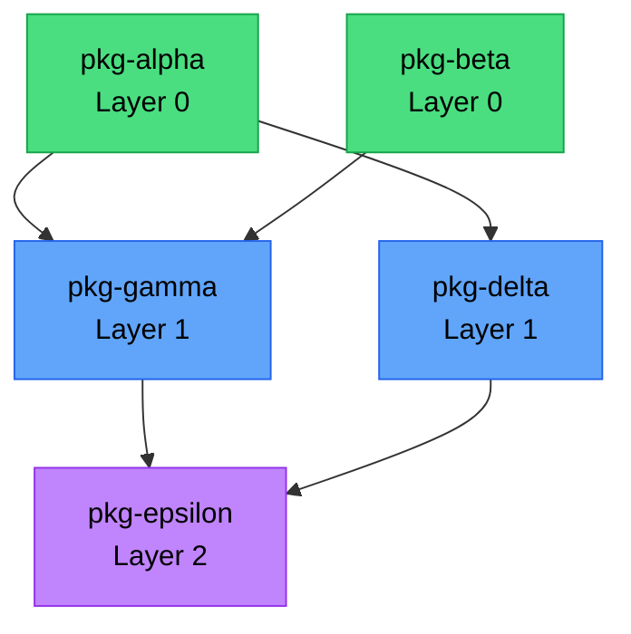

# Build System

`uvr` builds interdependent packages in topological layers, making earlier wheels available to later builds via `--find-links`.

## The problem

Consider a workspace where `pkg-beta` has a build-time dependency on `pkg-alpha`.

```toml
# packages/pkg-beta/pyproject.toml
[build-system]
requires = ["hatchling", "pkg-alpha"]
build-backend = "hatchling.build"
```

When releasing both simultaneously, `pkg-alpha` 0.1.5 doesn't exist on PyPI yet. `uv build` uses [build isolation](https://packaging.python.org/en/latest/tutorials/packaging-projects/#generating-distribution-archives) where `[tool.uv.sources]` isn't available. `uvr` solves this by building in order.

## Layered builds with `--find-links`

Each topological layer builds after the previous one completes. `--find-links dist/` tells uv's build isolation to resolve `[build-system].requires` from local wheels first.

```bash
# Layer 0 — no internal deps
uv build packages/pkg-alpha --out-dir dist/ --find-links dist/ --find-links deps/ --no-sources

# Layer 1 — depends on layer 0
uv build packages/pkg-beta  --out-dir dist/ --find-links dist/ --find-links deps/ --no-sources
uv build packages/pkg-delta --out-dir dist/ --find-links dist/ --find-links deps/ --no-sources

# Layer 2 — depends on layer 1
uv build packages/pkg-gamma --out-dir dist/ --find-links dist/ --find-links deps/ --no-sources
```

## Why `--no-sources`

`uvr` passes `--no-sources` to `uv build` because source resolution during a release build is problematic.

- **Correctness.** Without it, an isolated build may pull an old version of the dependency from PyPI instead of the one being released.
- **Fidelity.** Source builds (especially editable installs) can skip build logic that the real wheel includes.
- **Efficiency.** Every isolated `uv build` would rebuild dependencies from source. Pre-built wheels avoid redundant work.

## Topological sorting

Layer assignment via `topo_layers()` uses a modified Kahn's algorithm.

```
Input:
  pkg-alpha  deps: []          → layer 0
  pkg-beta   deps: [pkg-alpha] → layer 1
  pkg-delta  deps: [pkg-alpha] → layer 1
  pkg-gamma  deps: [pkg-beta]  → layer 2
```



Packages in the same layer have no interdependencies and build sequentially. Cycles raise `RuntimeError`.

The algorithm processes in three steps.

1. Build in-degree and reverse-dependency maps from `Package.dependencies`.
2. Initialize all zero-in-degree nodes to layer 0.
3. Process the queue, updating each dependent's layer to `max(current_layer, dependency_layer + 1)` and decrementing in-degrees. If any nodes remain unprocessed after the queue empties, a circular dependency exists and plan generation fails.

## Per-runner build matrix

Runners are configured per-package.

```toml
[tool.uvr.runners]
pkg-alpha = [["ubuntu-latest"], ["macos-latest"]]
pkg-beta = [["ubuntu-latest"]]
```

Packages not listed default to `[["ubuntu-latest"]]`. Labels are lists for [composite runner selection](https://docs.github.com/en/actions/using-github-hosted-runners/using-github-hosted-runners/about-github-hosted-runners#standard-github-hosted-runners-for-public-repositories) (e.g., `["self-hosted", "linux", "arm64"]`).

The matrix is per-runner, not per-package. Each runner builds all its assigned packages in topological order, keeping wheels in a local `dist/`. This avoids coordinating artifact passing between separate CI jobs for build-time deps.

Runner filtering uses the `UVR_RUNNER` environment variable.

## Build stages

For each runner, the planner generates a sequence of stages.

**Setup.** Create `dist/` and fetch wheels for unchanged transitive deps from GitHub releases.

```
mkdir -p dist
gh release download pkg-beta/v0.2.0 --pattern "*.whl" --dir dist/
```

**Build.** One stage per topological layer, sequential within each.

```
Layer 0:
  pkg-alpha:
    uv build packages/pkg-alpha --out-dir dist/ --find-links dist/ --find-links deps/ --no-sources

Layer 1:
  pkg-beta:
    uv build packages/pkg-beta --out-dir dist/ --find-links dist/ --find-links deps/ --no-sources
  pkg-delta:
    uv build packages/pkg-delta --out-dir dist/ --find-links dist/ --find-links deps/ --no-sources
```

## CI execution

Each runner gets its own CI job.

```yaml
strategy:
  fail-fast: true
  matrix:
    runner: ${{ fromJSON(inputs.plan).build_matrix }}
runs-on: ${{ matrix.runner }}
```

```bash
uvr jobs build
```

The plan and runner are passed via `UVR_PLAN` and `UVR_RUNNER` environment variables.

Each runner uploads wheels as `wheels-<runner-labels>`. The release job downloads all `wheels-*` artifacts and merges them.
