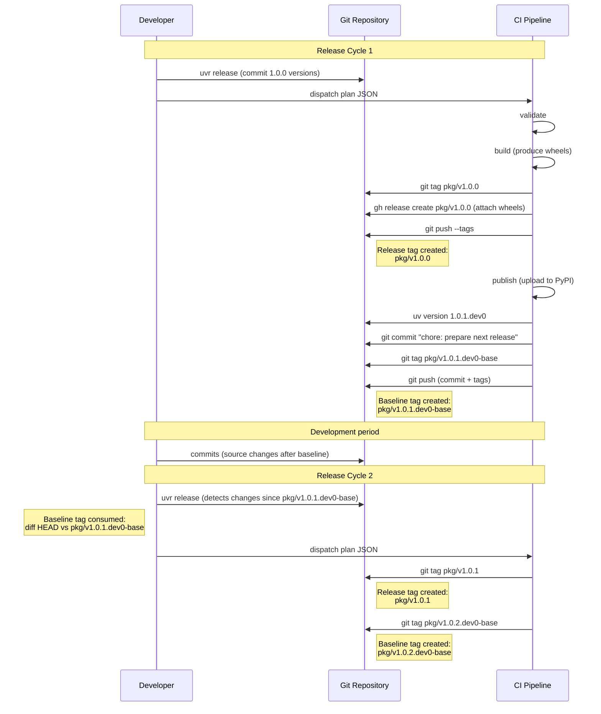
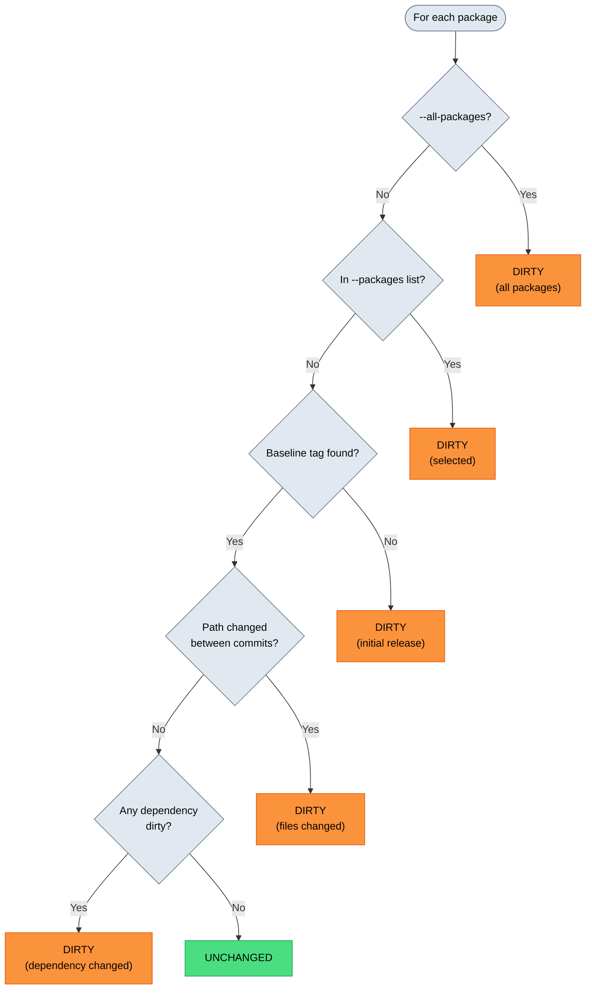
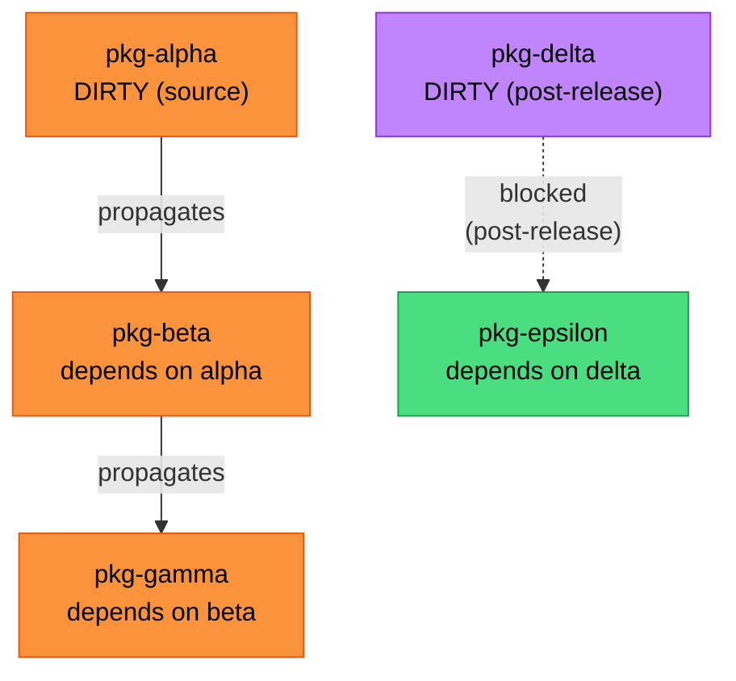

# Change Detection

`uvr` determines which packages need releasing by diffing each package against its baseline tag and propagating dirtiness through the dependency graph.

## Tag formats

`uvr` uses two kinds of git tags.

**Release tags** follow the pattern `{name}/v{version}`. They are created during the release phase and mark the commit where a version was published. They double as GitHub release identifiers where wheels are stored.

```
pkg-alpha/v0.1.5
pkg-beta/v0.2.0
pkg-gamma/v1.0.0a0
```

**Baseline tags** follow the pattern `{name}/v{version}-base`. They are created during the bump phase, on the commit that bumps to the next [dev version](https://peps.python.org/pep-0440/#developmental-releases). These are the diff base for the next release. Only commits *after* this tag are considered new work.

```
pkg-alpha/v0.1.6.dev0-base
pkg-beta/v0.2.1.dev0-base
pkg-gamma/v1.0.0a1.dev0-base
```

The lifecycle looks like this.

```
commit A  <- pkg-alpha/v0.1.5              (release tag)
commit B  <- pkg-alpha/v0.1.6.dev0-base    (baseline; pyproject.toml bumped to 0.1.6.dev0)
commits   ... development ...
commit C  <- pkg-alpha/v0.1.6              (release tag)
commit D  <- pkg-alpha/v0.1.7.dev0-base    (baseline; pyproject.toml bumped to 0.1.7.dev0)
```

The baseline tag sits on the bump commit, not the release commit. This means the version bump itself is excluded from the next release's diff.

## Tag lifecycle

This diagram shows how the two tag types are created and consumed across two consecutive release cycles for a single package.



| Tag Type | Created By | Consumed By | Purpose |
|---|---|---|---|
| `{name}/v{version}` (release) | release job | `_find_previous_release()`, GitHub release identifier, `DownloadWheelsCommand` | Marks published version |
| `{name}/v{version}-base` (baseline) | bump job | `_find_baseline_tag()` during next release cycle's change detection | Diff anchor for next release |

Release tags are long-lived. They are referenced by `_find_previous_release()` to locate the baseline for clean versions. They also serve as the source for downloading unchanged dependency wheels via `DownloadWheelsCommand`.

Baseline tags are consumed exactly once, during the next release cycle's change detection. After that cycle completes, a new baseline tag is created for the next cycle. Old baseline tags remain in the repository but are no longer actively queried.

## Package discovery

`Workspace.parse()` reads `[tool.uv.workspace].members`, expands globs, collects metadata (name, version, internal deps), and applies `[tool.uvr.config]` filters.

```toml
[tool.uvr.config]
include = ["pkg-alpha", "pkg-beta"]   # allowlist
exclude = ["pkg-debug"]               # denylist
```

## Dirty detection

Change detection determines which packages are "dirty" and need rebuilding. The result is a set of `Change` objects, where each package becomes dirty for a specific reason.



The decision tree evaluates top to bottom. If `--all-packages` is set, every package is dirty unconditionally. If a package appears in the `--packages` list, it is dirty regardless of whether files changed. If no baseline tag exists, the package is treated as an initial release and is always dirty. Otherwise the tree falls through to source comparison and dependency propagation.

## Source-dirty vs dependency-dirty

These two categories are the primary dirty reasons during normal operation.

**Source-dirty** means files inside the package directory changed since the baseline commit. Detection uses tree OID comparison via pygit2, which runs in O(depth) time rather than diffing every file. If the git tree hash at the package path differs between the baseline commit and HEAD, the package is dirty.

**Dependency-dirty** means the package itself has not changed, but one of its workspace dependencies is dirty. After direct dirty detection finishes, a BFS traversal over the reverse dependency map marks all transitive dependents as dirty.

## Transitive propagation

After direct dirtiness is determined, changes propagate upward through the dependency graph via BFS over a reverse dependency map.

```
pkg-alpha changes
  -> pkg-beta marked dirty   (depends on alpha)
  -> pkg-delta marked dirty  (depends on alpha)
  -> pkg-gamma marked dirty  (depends on beta, transitively)
```

[Post-release](https://peps.python.org/pep-0440/#post-releases) packages do not propagate. A post-fix only affects the target package, not its dependents.



In this example, `pkg-alpha` changed and propagates dirtiness to `pkg-beta` and then to `pkg-gamma`. But `pkg-delta` is a clean post-release, so its dirtiness does not propagate to `pkg-epsilon`.

## Baseline resolution

Baseline resolution determines which git tag to diff against when checking for changes. The function `_find_baseline_tag()` takes the package name, its current `Version`, and the `GitRepo`, then returns a `Tag` (or `None` for new packages).

The baseline depends on the `VersionState` of the current version. Resolution follows different strategies depending on which group the `VersionState` falls into.

### DEV0 states

Look up the baseline tag for the current version. If that tag does not exist, fall back to `_find_previous_release()`, which scans all release tags and returns the highest version below the current one.

| VersionState | Example version | Baseline tag looked up | Fallback |
|---|---|---|---|
| `DEV0_STABLE` | `1.2.3.dev0` | `pkg/v1.2.3.dev0-base` | Highest release tag below `1.2.3` |
| `DEV0_PRE` | `1.2.3a1.dev0` | `pkg/v1.2.3a1.dev0-base` | Highest release tag below `1.2.3a1` |
| `DEV0_POST` | `1.2.3.post0.dev0` | `pkg/v1.2.3.post0.dev0-base` | Highest release tag below `1.2.3.post0` |

### DEVK states

Rewind the dev number to 0, then look up the baseline tag for that `.dev0` version. This ensures that all changes since the start of the cycle are included, not just changes since the last dev release. If that tag does not exist, fall back to `_find_previous_release()`.

| VersionState | Example version | Rewound to | Baseline tag looked up | Fallback |
|---|---|---|---|---|
| `DEVK_STABLE` | `1.2.3.dev3` | `1.2.3.dev0` | `pkg/v1.2.3.dev0-base` | Highest release tag below `1.2.3` |
| `DEVK_PRE` | `1.2.3a1.dev2` | `1.2.3a1.dev0` | `pkg/v1.2.3a1.dev0-base` | Highest release tag below `1.2.3a1` |
| `DEVK_POST` | `1.2.3.post0.dev3` | `1.2.3.post0.dev0` | `pkg/v1.2.3.post0.dev0-base` | Highest release tag below `1.2.3.post0` |

### Clean states without post suffix

Go directly to `_find_previous_release()`. No baseline tag lookup is attempted.

| VersionState | Example version | Diffs against |
|---|---|---|
| `CLEAN_STABLE` | `1.2.3` | Highest release tag below `1.2.3` |
| `CLEAN_PRE0` | `1.2.3a0` | Highest release tag below `1.2.3a0` |
| `CLEAN_PREN` | `1.2.3a2` | Highest release tag below `1.2.3a2` |

### Clean post states

Look up the release tag for the base version (the stable version without the `.postN` suffix). This diffs against the stable release that the post-fix targets.

| VersionState | Example version | Baseline tag looked up |
|---|---|---|
| `CLEAN_POST0` | `1.2.3.post0` | `pkg/v1.2.3` |
| `CLEAN_POSTM` | `1.2.3.post2` | `pkg/v1.2.3` |

### Key patterns

- DEV0 versions resolve to their own `-base` tag first, then fall back to the previous release tag. The `-base` tag was created by the bump phase of the previous release and marks the start of the current dev cycle.
- DEVK versions (where K > 0) always rewind to the `.dev0` baseline tag. This means all changes since the cycle started are included, not just changes since the last dev release.
- Clean versions (no `.dev` suffix) are transient. Stable and pre-release clean versions resolve to the previous release tag. Clean post-release versions resolve to the release tag on the base stable version.
- `_find_previous_release()` scans all tags matching the `{name}/v*` prefix, excluding baseline tags (those ending in `-base`). It parses each tag as a PEP 440 version, filters to those below the target version, and returns the highest match. If no matching tag exists, it returns `None`, which means the package has no previous release and will always be marked dirty as an "initial release".
