# Package State Machine and Data Model

Comprehensive reference for how uvr models package state in a uv workspace monorepo.
Covers version transitions, dirty detection, baseline resolution, the release pipeline,
and partial failure states.

## Table of Contents

- [Data Model](#data-model)
- [Version State Space](#version-state-space)
- [Change Detection](#change-detection)
- [Baseline Resolution](#baseline-resolution)
- [Dependency Graph and Build Ordering](#dependency-graph-and-build-ordering)
- [Release Pipeline](#release-pipeline)
- [Failure Modes and Partial States](#failure-modes-and-partial-states)
- [Tag Lifecycle](#tag-lifecycle)

---

## Data Model

Three structures represent a package at different points in the release pipeline.

### PackageInfo

The base representation of any workspace package. Collected during discovery by scanning
`[tool.uv.workspace].members` globs and reading each `pyproject.toml`.

| Field     | Type         | Description                                    |
|-----------|--------------|------------------------------------------------|
| `path`    | `str`        | Relative path from workspace root              |
| `version` | `str`        | Current PEP 440 version from `pyproject.toml`  |
| `deps`    | `list[str]`  | Internal (workspace) dependency names           |

Only `[project].dependencies` and `[build-system].requires` are tracked in `deps`.
Optional dependencies and dependency groups are excluded because they do not affect
build ordering.

### ChangedPackage

Extends `PackageInfo` with lifecycle information for packages that will be released.
Created during plan generation after change detection.

| Field              | Type             | Description                                         |
|--------------------|------------------|-----------------------------------------------------|
| `current_version`  | `str`            | Version in `pyproject.toml` before any changes      |
| `release_version`  | `str`            | Version that will be published                      |
| `next_version`     | `str`            | Post-release dev version to bump to after release   |
| `last_release_tag` | `str` or `None`  | Most recent `{name}/v{version}` tag                 |
| `baseline_tag`     | `str` or `None`  | Tag used as the diff baseline for change detection  |
| `release_notes`    | `str`            | Markdown release notes                              |
| `make_latest`      | `bool` or `None` | Whether this gets the GitHub "Latest" badge          |
| `runners`          | `list[list[str]]` | Runner label sets for the build matrix             |

### ReleasePlan

The self-contained JSON plan generated locally and consumed by CI. Contains every command
the executor needs. CI runs zero logic, zero version arithmetic, zero git operations
beyond what the plan dictates.

| Field                | Type                                      | Description                                |
|----------------------|-------------------------------------------|--------------------------------------------|
| `changed`            | `dict[str, ChangedPackage]`               | Packages to rebuild and release            |
| `unchanged`          | `dict[str, PackageInfo]`                  | Packages reused from previous releases     |
| `build_commands`     | `dict[RunnerKey, list[BuildStage]]`       | Per-runner build command sequences         |
| `release_commands`   | `list[ReleaseCommand]`                    | Tag + GitHub release creation commands     |
| `publish_commands`   | `list[PublishCommand]`                    | PyPI publishing commands                   |
| `bump_commands`      | `list[BumpCommand]`                       | Version bump, dep pin, baseline tag commands |
| `skip`               | `list[str]`                               | Job names to skip                          |
| `reuse_run_id`       | `str`                                     | CI run ID to reuse artifacts from          |
| `build_matrix`       | `list[list[str]]`                         | Unique runner sets for CI matrix           |

---

## Version State Space

A package's version in `pyproject.toml` follows PEP 440. uvr recognizes six distinct
version forms. Each form determines which release types are valid, how baselines are
resolved, and what the post-release bump looks like.

### The six version forms

| Form                          | Example            | Description                         |
|-------------------------------|---------------------|-------------------------------------|
| Clean final                   | `1.2.3`            | Released stable version (transient) |
| Dev after final               | `1.2.3.dev0`       | Development toward `1.2.3`         |
| Clean pre-release             | `1.2.3a1`          | Released pre-release (transient)    |
| Dev after pre-release         | `1.2.3a1.dev0`     | Development toward `1.2.3a1`       |
| Clean post-release            | `1.2.3.post0`      | Released post-fix (transient)       |
| Dev after post-release        | `1.2.3.post0.dev0` | Development toward `1.2.3.post0`   |

"Transient" forms exist briefly during the release pipeline between the
"set release versions" commit and the "prepare next release" bump commit.
The "dev" forms are the at-rest states that developers see during normal work.

When `N > 0` on a `.devN` suffix, it means `.dev{N-1}` was published as a dev
release (`uvr release --dev`). The versions `1.2.3.dev0` and `1.2.3.dev3` are
both valid at-rest states, but they resolve baselines differently.

### Stable release cycle

The most common path. Development happens at `.dev0`, release strips the suffix,
and the bump phase advances to the next patch.

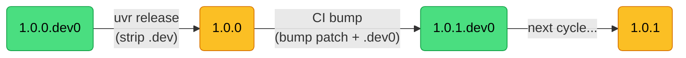

### Pre-release cycle

Enter a pre-release track with `uvr bump --alpha`, iterate with `uvr release --pre`,
graduate to the next kind with `uvr bump --beta` or `--rc`, and exit to stable with
`uvr release` (no `--pre` flag).

```mermaid
flowchart LR
    classDef rest fill:#4ade80,stroke:#16a34a,color:#000
    classDef transient fill:#fbbf24,stroke:#d97706,color:#000

    dev0("1.0.0.dev0"):::rest
    adev("1.0.0a0.dev0"):::rest
    a0("1.0.0a0"):::transient
    a1dev("1.0.0a1.dev0"):::rest
    bdev("1.0.0b0.dev0"):::rest
    b0("1.0.0b0"):::transient
    b1dev("1.0.0b1.dev0"):::rest
    rcdev("1.0.0rc0.dev0"):::rest
    stable("1.0.0"):::transient
    next("1.0.1.dev0"):::rest

    dev0 -->|"uvr bump --alpha"| adev
    adev -->|"uvr release --pre"| a0
    a0 -->|"CI bump"| a1dev
    a1dev -->|"uvr bump --beta"| bdev
    bdev -->|"uvr release --pre"| b0
    b0 -->|"CI bump"| b1dev
    b1dev -->|"uvr bump --rc"| rcdev
    rcdev -->|"uvr release<br/>(stable)"| stable
    stable -->|"CI bump"| next
```

Pre-release kind can only move forward. `a` to `b` and `b` to `rc` are valid.
`rc` to `a` is rejected by `validate_bump()`.

### Post-release cycle

Post-releases fix a published stable version without bumping the version number.
Enter with `uvr bump --post` from a clean final version.

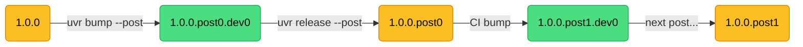

Post-release versions cannot enter pre-release and vice versa. These are separate
tracks from a given stable version.

### Dev release cycle

Dev releases publish the `.devN` version as-is rather than stripping it. The bump
phase increments the dev number instead of the patch.

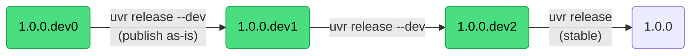

Dev releases can happen from any `.dev` version. A stable release from `.devN`
strips the suffix and publishes the underlying version.

### Release version transformation

How `current_version` maps to `release_version` and `next_version` for each release
type.

| Current Version     | Release Type | Release Version  | Next Version        |
|---------------------|-------------|-------------------|---------------------|
| `1.0.0.dev0`       | stable      | `1.0.0`          | `1.0.1.dev0`        |
| `1.0.0.dev3`       | stable      | `1.0.0`          | `1.0.1.dev0`        |
| `1.0.0.dev0`       | dev         | `1.0.0.dev0`     | `1.0.0.dev1`        |
| `1.0.0.dev3`       | dev         | `1.0.0.dev3`     | `1.0.0.dev4`        |
| `1.0.0a0.dev0`     | pre         | `1.0.0a0`        | `1.0.0a1.dev0`      |
| `1.0.0a2.dev0`     | stable      | `1.0.0`          | `1.0.1.dev0`        |
| `1.0.0.post0.dev0` | post        | `1.0.0.post0`    | `1.0.0.post1.dev0`  |

### Invalid transitions

These version/release-type combinations are rejected with a `ValueError`.

| Current Version     | Attempted Release Type | Why                                       |
|---------------------|------------------------|-------------------------------------------|
| `X.Y.Z.dev0`       | pre                    | No pre-release suffix in version          |
| `X.Y.Z.dev0`       | post                   | Cannot post-release an unreleased version |
| `X.Y.Za0.dev0`     | post                   | Pre-releases are unreleased versions      |
| `X.Y.Z.post0.dev0` | stable                 | Cannot stable-release from post track     |
| `X.Y.Z.post0.dev0` | pre                    | Cannot pre-release from post track        |

---

## Change Detection

Change detection determines which packages are "dirty" and need rebuilding.
The result is a flat set of package names, but each package becomes dirty for
a specific reason.

### Dirty reasons

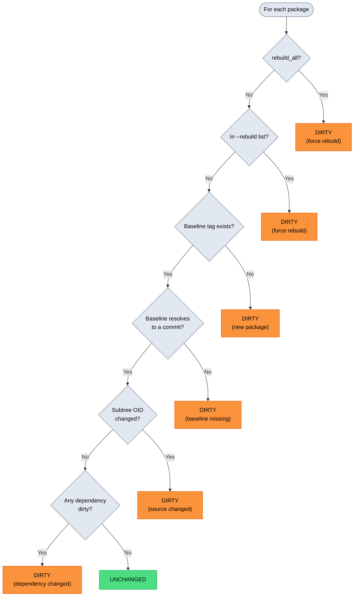

### Source-dirty vs dependency-dirty

These two categories are the primary dirty reasons during normal operation.

**Source-dirty** means files inside the package directory changed since the baseline
commit. Detection uses subtree OID comparison via pygit2, which runs in O(depth)
time rather than diffing every file. If the git tree hash at the package path
differs between baseline and HEAD, the package is dirty.

**Dependency-dirty** means the package itself has not changed, but one of its
workspace dependencies is dirty. After direct dirty detection finishes, a BFS
traversal over the reverse dependency map marks all transitive dependents as dirty.

One exception exists for dependency propagation. Post-release packages do not
propagate dirtiness to their dependents. A post-fix only affects the target
package, not anything that depends on it.

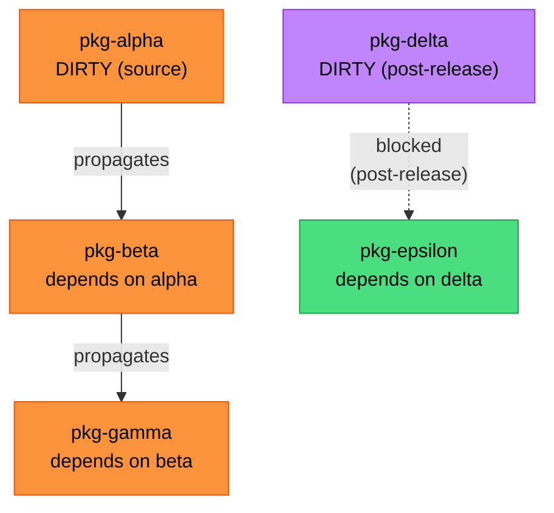

In this example, `pkg-alpha` changed and propagates dirtiness to `pkg-beta`
and then to `pkg-gamma`. But `pkg-delta` is a post-release, so its dirtiness
does not propagate to `pkg-epsilon`.

### The effective baseline override

When a package version has no `.dev` suffix (it is a clean final/pre/post version)
AND its release tag already exists in the repo, change detection uses the release tag
as the effective baseline instead of the dev baseline tag.

This correctly identifies packages as unchanged when they sit at an already-released
version. The situation arises on post-release branches or after a manual stable bump.

```
pyproject.toml says:  1.0.0          (clean, no .dev)
release tag exists:   pkg/v1.0.0     (already released)
effective baseline:   pkg/v1.0.0     (diff against release, not dev baseline)
```

If no files changed since the release tag, the package is unchanged.

---

## Baseline Resolution

Baseline resolution determines which git tag to diff against when checking for
changes. The function `resolve_baseline()` takes the current version and release
type and returns a tag name (or `None` for new packages).

### Tag formats

uvr uses two tag formats throughout its lifecycle.

**Release tags** follow the pattern `{name}/v{version}` and are created during the
release phase of CI. They mark the commit where a version was published and serve as
GitHub release identifiers where wheels are stored.

```
pkg-alpha/v1.0.0
pkg-beta/v0.2.0
pkg-gamma/v1.0.0a0
```

**Baseline tags** follow the pattern `{name}/v{version}-base` and are created during
the bump phase of CI. They mark the commit where the next dev version was written
to `pyproject.toml`. Only commits after this tag count as new work for the next release.

```
pkg-alpha/v1.0.1.dev0-base
pkg-beta/v0.2.1.dev0-base
pkg-gamma/v1.0.0a1.dev0-base
```

### Resolution matrix

When uvr detects changes, it needs a baseline tag to diff against. The baseline
depends on two inputs: the current version in `pyproject.toml` and how
`uvr release` is invoked.

The "release type" is not a user-facing flag. It is auto-detected internally from
the version string by `detect_release_type_for_version()`. The only CLI override
is `--dev`, which forces the dev release path regardless of version.

- Version contains `a`, `b`, or `rc` suffix -> auto-detected as **pre**
- Version contains `.post` suffix -> auto-detected as **post**
- Otherwise -> auto-detected as **stable**

Each row reads as: "If `pyproject.toml` says **version** and you run
**command**, then change detection diffs HEAD against **baseline tag**."

These examples assume the package is named `pkg` and that `pkg/v1.2.2` is the
most recent stable release tag and `pkg/v1.2.3.post1` is the most recent
post-release tag.

#### Stable track (`uvr release`)

| Current version | Baseline tag | Diffs against |
|---|---|---|
| `1.2.3` | `pkg/v1.2.2` | The previous release commit |
| `1.2.3.dev0` | `pkg/v1.2.3.dev0-base` | The commit that bumped to `1.2.3.dev0` |
| `1.2.3.dev3` | `pkg/v1.2.3.dev0-base` | Rewinds to cycle start (all dev iterations included) |

#### Pre-release track (`uvr release` when version has `a`/`b`/`rc` suffix)

| Current version | Baseline tag | Diffs against |
|---|---|---|
| `1.2.3a1` | `pkg/v1.2.2` | The previous stable release commit |
| `1.2.3a1.dev0` | `pkg/v1.2.3a1.dev0-base` | The commit that bumped to `1.2.3a1.dev0` |
| `1.2.3a1.dev2` | `pkg/v1.2.3a1.dev0-base` | Rewinds to cycle start (all dev iterations included) |

When graduating from pre-release to stable (e.g. version is `1.2.3a1.dev0` but you
manually strip the pre suffix before releasing), the baseline goes all the way back
to the previous final release (`pkg/v1.2.2`). This is cumulative mode and ensures
the stable release includes all changes made during the entire pre-release cycle.

#### Post-release track (`uvr release` when version has `.post` suffix)

| Current version | Baseline tag | Diffs against |
|---|---|---|
| `1.2.3.post0` | `pkg/v1.2.3` | The stable release this post-fix targets |
| `1.2.3.post0.dev0` | `pkg/v1.2.3.post0.dev0-base` | The commit that bumped to `1.2.3.post0.dev0` |
| `1.2.3.post0.dev3` | `pkg/v1.2.3.post0.dev0-base` | Rewinds to cycle start (all dev iterations included) |
| `1.2.3.post2` | `pkg/v1.2.3.post1` | The previous post-release commit |
| `1.2.3.post2.dev0` | `pkg/v1.2.3.post2.dev0-base` | The commit that bumped to `1.2.3.post2.dev0` |
| `1.2.3.post2.dev3` | `pkg/v1.2.3.post2.dev0-base` | Rewinds to cycle start (all dev iterations included) |

#### Dev release track (`uvr release --dev`)

The `--dev` flag overrides auto-detection. The baseline is always the current
version's own `-base` tag with no rewinding.

| Current version | Baseline tag | Diffs against |
|---|---|---|
| `1.2.3.dev0` | `pkg/v1.2.3.dev0-base` | The commit that bumped to `1.2.3.dev0` |
| `1.2.3.dev3` | `pkg/v1.2.3.dev3-base` | The commit that bumped to `1.2.3.dev3` |
| `1.2.3a1.dev0` | `pkg/v1.2.3a1.dev0-base` | The commit that bumped to `1.2.3a1.dev0` |
| `1.2.3.post2.dev0` | `pkg/v1.2.3.post2.dev0-base` | The commit that bumped to `1.2.3.post2.dev0` |

#### Invalid combinations

These are rejected with a `ValueError` during baseline resolution.

| Current version | Attempted release | Why |
|---|---|---|
| `1.2.3.dev0` | `uvr release --dev` then auto-detect as post | Cannot post-release an unreleased version |
| `1.2.3a1.dev0` | manually set to post track | Cannot post-release a pre-release |
| `1.2.3.post2.dev0` | manually set to stable track | Cannot stable-release from post track |
| `1.2.3.post2.dev0` | manually set to pre track | Cannot pre-release from post track |

These errors only arise from invalid version states (e.g. manually editing
`pyproject.toml` into a contradictory version). Normal workflows through
`uvr bump` and `uvr release` never produce them.

#### Key patterns

- **Clean versions** (no `.dev` suffix) are transient. They always resolve to the
  previous release tag.
- **`.dev0` versions** resolve to their own `-base` tag. That tag was created by the
  bump phase of the previous release and marks the start of the current dev cycle.
- **`.devN` where N > 0** resolve differently depending on release type. A `--dev`
  release uses the exact `.devN-base` tag (incremental). All other release types
  rewind to `.dev0-base` so that all changes since the cycle started are included.

### Resolution by version form

One unified flowchart showing the full baseline resolution and release lifecycle
for every version form. The decision tree branches on version shape first, then
on command (`uvr release` vs `uvr release --dev`).

For tag lookups, `pkg` is the package name. "Scan tags" means scanning all
`pkg/v*` tags (excluding `-base` suffixes), parsing as PEP 440, and returning
the highest version below the current one.

#### `uvr release` (default)

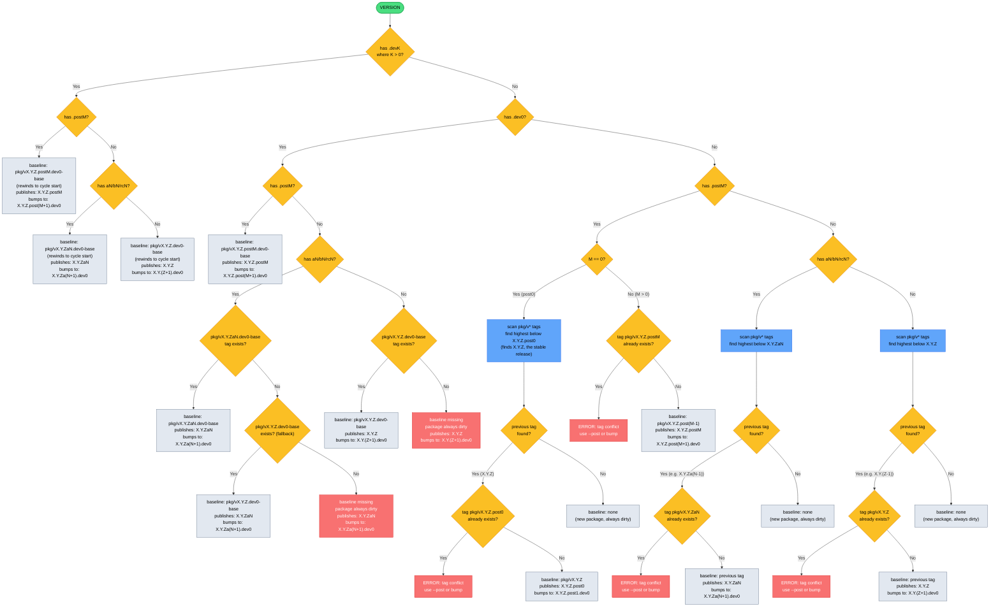

#### `uvr release --dev`

The `--dev` flag requires all changed packages to have a `.devK` version.
Clean versions (no `.dev` suffix) cause an error.

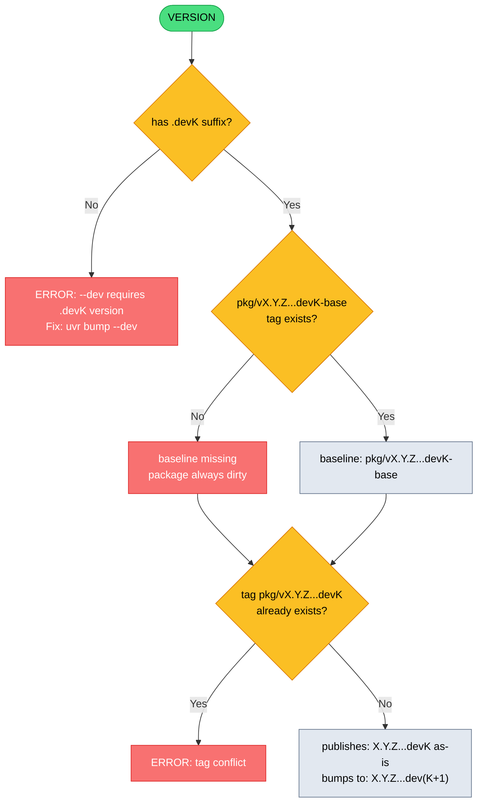

### Resolution flowchart

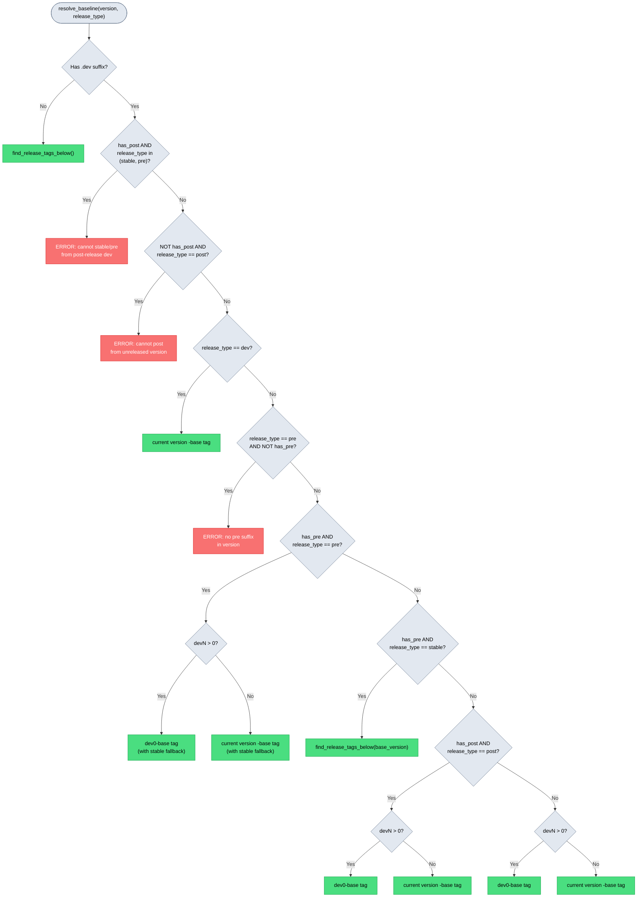

### Pre-release baseline fallback

When entering a pre-release cycle from a dev version (e.g. `uvr bump --alpha` turns
`1.0.0.dev0` into `1.0.0a0.dev0`), the expected baseline tag `pkg/v1.0.0a0.dev0-base`
may not exist yet because no bump phase created it.

In this case, `resolve_baseline()` falls back to the stable dev baseline
`pkg/v1.0.0.dev0-base`. This allows entering alpha without a manual tag creation step.

The fallback only applies to `--pre` release type. If the fallback tag also does not
exist, the original pre-release baseline tag is returned (and change detection will
mark the package dirty due to a missing baseline).

---

## Dependency Graph and Build Ordering

### Topological layer assignment

uvr assigns each package a **layer number** using a modified Kahn's algorithm.
Packages in the same layer have no dependencies on each other and can build
concurrently. Layers execute sequentially so that earlier layers complete before
later layers start.

```
Layer 0: packages with zero internal dependencies
Layer N: packages whose deepest dependency is in layer N-1
```

The algorithm processes in three steps.

1. Build in-degree and reverse-dependency maps from `PackageInfo.deps`
2. Initialize all zero-in-degree nodes to layer 0
3. Process the queue, updating each dependent's layer to
   `max(current_layer, dependency_layer + 1)` and decrementing in-degrees

If any nodes remain unprocessed after the queue empties, a circular dependency
exists and plan generation fails with a `RuntimeError`.

### Example

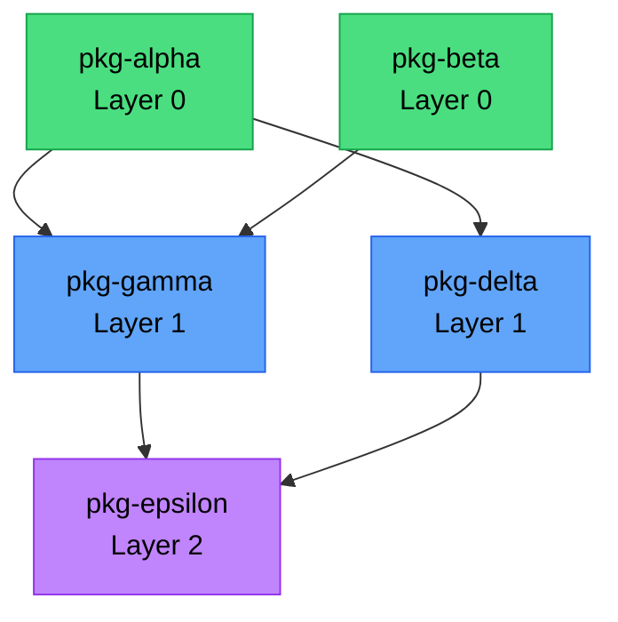

In this example, `pkg-alpha` and `pkg-beta` build concurrently in layer 0.
Then `pkg-gamma` and `pkg-delta` build concurrently in layer 1. Finally
`pkg-epsilon` builds alone in layer 2.

### Build stage structure

Each topological layer becomes a `BuildStage` in the plan. A stage has three parts.

| Part       | Execution          | Purpose                                        |
|------------|--------------------|-------------------------------------------------|
| `setup`    | Sequential         | Create directories, fetch unchanged deps        |
| `packages` | Concurrent per-pkg | `uv build` for each package in this layer       |
| `cleanup`  | Sequential         | Remove transitive dep wheels from `dist/`       |

The setup phase of the first stage fetches wheels for unchanged dependencies from
GitHub releases (or CI run artifacts if `reuse_run_id` is set). This uses the
`DownloadWheelsCommand` which implements BFS transitive resolution by parsing
wheel `METADATA` for internal dependencies.

### Runner matrix

Packages can be assigned to different CI runners (e.g. `ubuntu-latest` and
`macos-latest` for platform-specific wheels). The plan groups packages by runner
and generates independent build stage sequences per runner. CI fans out via
`strategy.matrix` using the plan's `build_matrix` field.

In local mode (`--where local`), only runners matching the current platform execute.

---

## Release Pipeline

The release pipeline has two phases. The local phase runs on the developer's machine
and produces a JSON plan. The CI phase receives the plan and executes it as a sequence
of jobs with zero embedded logic.

### Overview

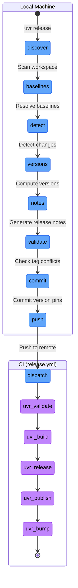

### Local phase details

| Step                  | What happens                                                    |
|-----------------------|-----------------------------------------------------------------|
| Scan workspace        | Read `[tool.uv.workspace].members`, apply include/exclude       |
| Resolve baselines     | Call `resolve_baseline()` per package per release type           |
| Detect changes        | Subtree OID comparison + transitive BFS propagation             |
| Compute versions      | `current_version` to `release_version` to `next_version`        |
| Generate release notes| Commit log between baseline and HEAD for each changed package   |
| Check tag conflicts   | Verify no planned tags already exist in the repo                |
| Commit version pins   | Write release versions + dep pins, commit "chore: set release versions" |
| Push + dispatch       | `git push`, then `gh workflow run release.yml -f plan=<json>`   |

If `--dry-run` is passed, everything through "Generate release notes" runs but
no commits, pushes, or dispatches happen.

### CI phase details

Each job is a separate GitHub Actions job. They run sequentially. Each job receives
the plan JSON via `inputs.plan` and calls `uvr jobs <phase>` which reads the
pre-computed commands from the plan and executes them.

#### uvr-validate

Always runs. Cannot be skipped. Validates the plan schema version and workflow YAML.

#### uvr-build

Runs as a matrix job, one per unique runner label set. Each runner executes its
assigned build stages.

1. Create `dist/` and `deps/` directories
2. Fetch unchanged dependency wheels (from run artifacts or GitHub releases)
3. For each topological layer, build all assigned packages concurrently
4. Clean up transitive dependency wheels not owned by this runner
5. Upload `dist/*.whl` as `wheels-<runner-labels>` artifact

#### uvr-release

Runs after all build matrix jobs complete. Downloads all `wheels-*` artifacts.

1. Tag the current commit with `{name}/v{release_version}` for each changed package
2. Create GitHub releases with wheels attached (ordered so the `latest` package is last)
3. Push all release tags

#### uvr-publish

Runs after release. Gated by a GitHub Actions environment for trusted publishing.

1. For each publishable changed package, run `uv publish` to upload wheels to the
   configured index

Packages are filtered by `[tool.uvr.publish]` include/exclude settings. If no
packages are publishable, this job is a no-op.

#### uvr-bump

Runs after publish. The only CI job that writes to the repository.

1. Bump each changed package to its `next_version` via `uv version`
2. Pin internal dependencies to just-published versions
3. Sync lockfile and commit "chore: prepare next release"
4. Create baseline tags `{name}/v{next_version}-base` for each changed package
5. Push commit and tags

---

## Failure Modes and Partial States

When a CI job fails, the pipeline stops and leaves the system in a partial state.
Understanding these states is essential for recovery.

### Partial state matrix

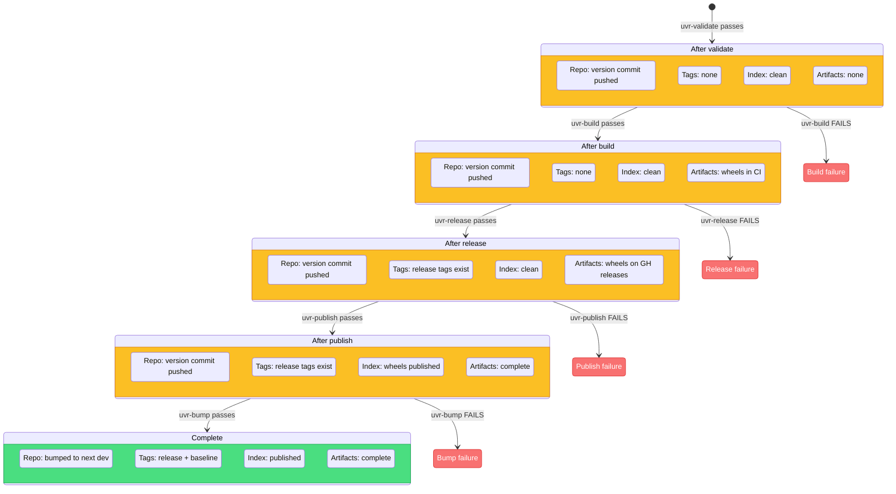

### Recovery commands

| Failure Point | System State | Recovery Command |
|---|---|---|
| **uvr-build fails** | Version commit pushed. No tags. No wheels. | Re-run the workflow, or revert the version commit and start over. |
| **uvr-release fails** | Wheels exist in CI artifacts. No tags created. | `uvr release --skip uvr-build --reuse-run <RUN_ID>` |
| **uvr-publish fails** | Release tags and GitHub releases exist. Wheels not on index. | `uvr release --skip uvr-build --skip uvr-release` |
| **uvr-bump fails** | Everything published. Repo not bumped to next dev. | `uvr release --skip uvr-build --skip uvr-release --skip uvr-publish` |

The `--reuse-run` flag tells the build phase to download wheels from the specified
CI run's artifacts instead of building from scratch. The `--skip` flag skips
individual jobs so downstream jobs still execute.

When `uvr-release` is skipped, release tag conflict checks are suppressed because
the tags already exist from the previous run.

### Tag conflict detection

Before generating a plan, the planner checks whether any planned tags already exist
in the local repo.

**Release tags** (`{name}/v{release_version}`) are checked unless `uvr-release` is
in the skip list (because skipping release means the tags already exist from a
previous successful run).

**Baseline tags** (`{name}/v{next_version}-base`) are always checked.

If any conflicts are found, the planner exits with suggestions.

1. Use `--post` to publish a post-release instead
2. Bump past the conflict with `uv version <next-version> --directory <pkg>`

### Version conflict detection

Separately from tag conflicts, `find_version_conflicts()` checks whether any
package's dev version targets a version that was already released. For example,
if `pyproject.toml` says `1.0.1a1.dev0` but the tag `pkg/v1.0.1a1` already exists,
the version was already published and should not be developed toward again.

The resolution is to bump the version past the conflict with `uvr bump`.

---

## Tag Lifecycle

This diagram shows how the two tag types are created and consumed across two
consecutive release cycles for a single package.

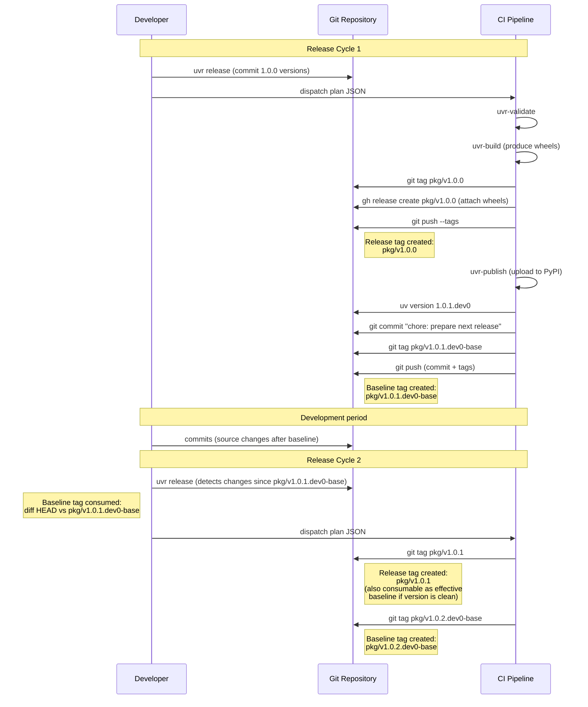

### Tag consumption summary

| Tag Type | Created By | Consumed By | Purpose |
|---|---|---|---|
| `{name}/v{version}` (release) | uvr-release phase | `find_release_tags_below()`, effective baseline override, GitHub release identifier | Marks published version |
| `{name}/v{version}-base` (baseline) | uvr-bump phase | `resolve_baseline()` during next release cycle's change detection | Diff anchor for next release |

Release tags are long-lived. They are referenced by `find_release_tags_below()` to
locate the baseline for clean versions. They also serve as the source for downloading
unchanged dependency wheels via `FetchGithubReleaseCommand`.

Baseline tags are consumed exactly once, during the next release cycle's change
detection. After that cycle completes, a new baseline tag is created for the next
cycle. Old baseline tags remain in the repository but are no longer actively queried.
