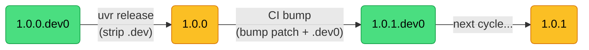
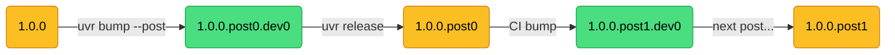
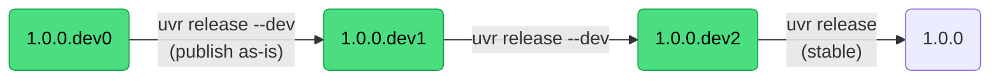
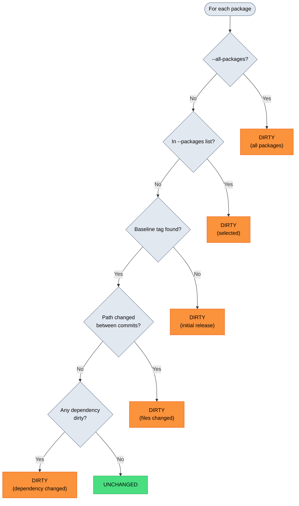
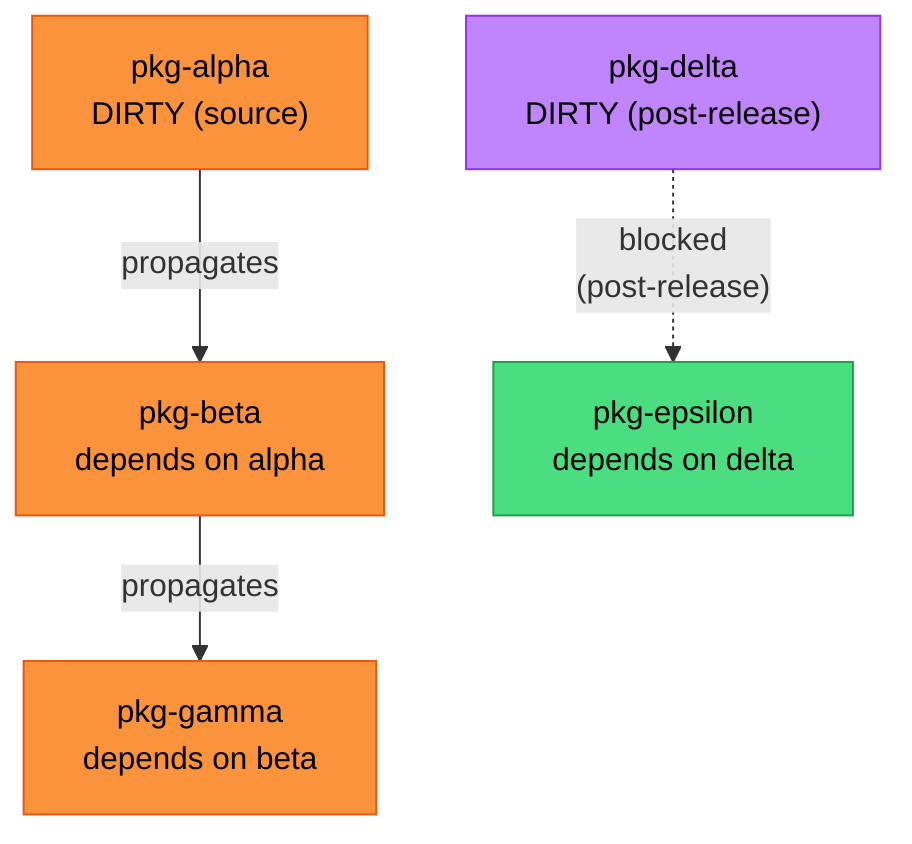
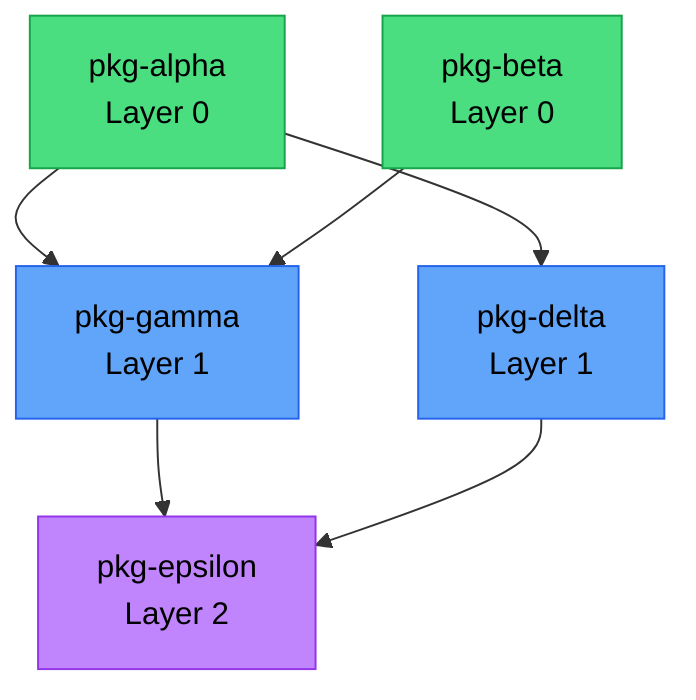
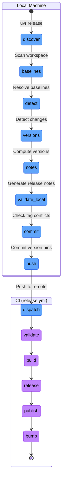
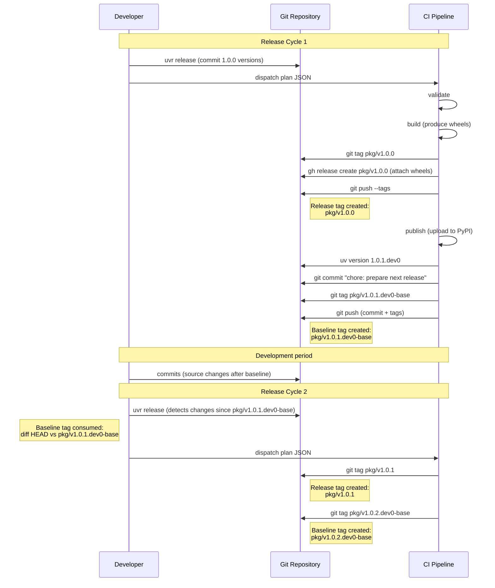

# Package State Machine and Data Model

Reference for how <code class="brand-code">uvr</code> models package state in a uv workspace monorepo.
Covers version transitions, dirty detection, baseline resolution, the release pipeline,
and partial failure states.

## Table of Contents

- [Data Model](#data-model)
- [Version State Space](#version-state-space)
- [Change Detection](#change-detection)
- [Baseline Resolution](#baseline-resolution)
- [Dependency Graph and Build Ordering](#dependency-graph-and-build-ordering)
- [Release Pipeline](#release-pipeline)
- [Failure Modes and Partial States](#failure-modes-and-partial-states)
- [Tag Lifecycle](#tag-lifecycle)

---

## Data Model

Three entity types represent a package at different points in the release pipeline.

### Package

The base representation of any workspace package. Collected during discovery by scanning
`[tool.uv.workspace].members` globs and reading each `pyproject.toml`.

| Field          | Type         | Description                                    |
|----------------|--------------|------------------------------------------------|
| `name`         | `str`        | Canonical package name                         |
| `path`         | `str`        | Relative path from workspace root              |
| `version`      | `Version`    | Current PEP 440 version from `pyproject.toml`  |
| `dependencies` | `list[str]`  | Internal (workspace) dependency names           |

Only `[project].dependencies` and `[build-system].requires` are tracked in `dependencies`.
Optional dependencies and dependency groups are excluded because they do not affect
build ordering.

### Change

Produced during change detection. Contains the Package along with its baseline tag and
a reason explaining why it was detected as dirty.

| Field         | Type             | Description                                         |
|---------------|------------------|-----------------------------------------------------|
| `package`     | `Package`        | The package that changed                            |
| `baseline`    | `Tag` or `None`  | Tag used as the diff baseline for change detection  |
| `diff_stats`  | `str` or `None`  | Output of `git diff --stat` against the baseline    |
| `commit_log`  | `str`            | Commit log between baseline and HEAD                |
| `reason`      | `str`            | Why the package was marked dirty                    |

### Release

Produced during plan generation. Contains the Package along with the computed
release version, next dev version, release notes, and whether this release should
get the GitHub "Latest" badge.

| Field              | Type      | Description                                         |
|--------------------|-----------|-----------------------------------------------------|
| `package`          | `Package` | The package to release                              |
| `release_version`  | `Version` | Version that will be published                      |
| `next_version`     | `Version` | Post-release dev version to bump to after release   |
| `release_notes`    | `str`     | Markdown release notes                              |
| `make_latest`      | `bool`    | Whether this gets the GitHub "Latest" badge          |

### Plan

The self-contained JSON plan generated locally and consumed by CI. Contains every command
the executor needs. CI runs zero logic, zero version arithmetic, zero git operations
beyond what the plan dictates.

| Field                  | Type                  | Description                                |
|------------------------|-----------------------|--------------------------------------------|
| `build_matrix`         | `list[list[str]]`     | Unique runner sets for CI matrix           |
| `python_version`       | `str`                 | Python version for CI                      |
| `publish_environment`  | `str`                 | GitHub Actions environment for publishing  |
| `skip`                 | `list[str]`           | Job names to skip                          |
| `reuse_run`            | `str`                 | CI run ID to reuse artifacts from          |
| `reuse_release`        | `bool`                | Whether to reuse GitHub release artifacts  |
| `jobs`                 | `list[Job]`           | Ordered list of jobs to execute            |
| `changes`              | `tuple[Change, ...]`  | Packages that changed (for read-only intents) |
| `validation_errors`    | `tuple[str, ...]`     | Errors detected during validation          |
| `validation_warnings`  | `tuple[str, ...]`     | Warnings detected during validation        |

---

## Version State Space

A package's version in `pyproject.toml` follows PEP 440. <code class="brand-code">uvr</code>
recognizes 11 distinct version forms via the `VersionState` enum. Each form determines which
release types are valid, how baselines are resolved, and what the post-release bump looks like.

### The 11 version forms

| VersionState     | Example              | Description                                        |
|------------------|----------------------|----------------------------------------------------|
| `CLEAN_STABLE`   | `1.2.3`             | Released stable version (transient)                |
| `DEV0_STABLE`    | `1.2.3.dev0`        | Start of development toward `1.2.3`               |
| `DEVK_STABLE`    | `1.2.3.dev3`        | After dev releases toward `1.2.3`                  |
| `CLEAN_PRE0`     | `1.2.3a0`           | First pre-release of a kind (transient)            |
| `CLEAN_PREN`     | `1.2.3a2`           | Subsequent pre-release (transient)                 |
| `DEV0_PRE`       | `1.2.3a1.dev0`      | Start of development toward `1.2.3a1`             |
| `DEVK_PRE`       | `1.2.3a1.dev3`      | After dev releases toward `1.2.3a1`               |
| `CLEAN_POST0`    | `1.2.3.post0`       | First post-release (transient)                     |
| `CLEAN_POSTM`    | `1.2.3.post2`       | Subsequent post-release (transient)                |
| `DEV0_POST`      | `1.2.3.post0.dev0`  | Start of development toward `1.2.3.post0`         |
| `DEVK_POST`      | `1.2.3.post0.dev3`  | After dev releases toward `1.2.3.post0`           |

"Transient" forms exist briefly during the release pipeline between the
"set release versions" commit and the "prepare next release" bump commit.
The "dev" forms are the at-rest states that developers see during normal work.

The distinction between `DEV0` and `DEVK` matters for baseline resolution.
`DEV0` means no dev releases have been published yet in this cycle.
`DEVK` (where K > 0) means at least one dev release was published, which shifts
the dev number forward.

The distinction between `CLEAN_PRE0` and `CLEAN_PREN` (and `CLEAN_POST0` vs `CLEAN_POSTM`)
matters for baseline resolution. The first release of a kind diffs against the previous
release, while subsequent ones can diff against the prior release of the same kind.

### Stable release cycle

The most common path. Development happens at `.dev0`, release strips the suffix,
and the bump phase advances to the next patch.



### Pre-release cycle

Enter a pre-release track with `uvr bump --alpha`, iterate with `uvr release`
(auto-detected as pre-release from the version string),
graduate to the next kind with `uvr bump --beta` or `--rc`, and exit to stable with
`uvr release` from an rc version (which strips the pre-release suffix).

```mermaid
flowchart LR
    classDef rest fill:#4ade80,stroke:#16a34a,color:#000
    classDef transient fill:#fbbf24,stroke:#d97706,color:#000

    dev0("1.0.0.dev0"):::rest
    adev("1.0.0a0.dev0"):::rest
    a0("1.0.0a0"):::transient
    a1dev("1.0.0a1.dev0"):::rest
    bdev("1.0.0b0.dev0"):::rest
    b0("1.0.0b0"):::transient
    b1dev("1.0.0b1.dev0"):::rest
    rcdev("1.0.0rc0.dev0"):::rest
    stable("1.0.0"):::transient
    next("1.0.1.dev0"):::rest

    dev0 -->|"uvr bump --alpha"| adev
    adev -->|"uvr release"| a0
    a0 -->|"CI bump"| a1dev
    a1dev -->|"uvr bump --beta"| bdev
    bdev -->|"uvr release"| b0
    b0 -->|"CI bump"| b1dev
    b1dev -->|"uvr bump --rc"| rcdev
    rcdev -->|"uvr release<br/>(stable)"| stable
    stable -->|"CI bump"| next
```



Pre-release kind can only move forward. `a` to `b` and `b` to `rc` are valid.
`rc` to `a` is rejected by `compute_bumped_version()`.

### Post-release cycle

Post-releases fix a published stable version without bumping the version number.
Enter with `uvr bump --post` from a clean final version.



Post-release versions cannot enter pre-release and vice versa. These are separate
tracks from a given stable version.

### Dev release cycle

Dev releases publish the `.devN` version as-is rather than stripping it. The bump
phase increments the dev number instead of the patch.



Dev releases can happen from any `.dev` version. A stable release from `.devN`
strips the suffix and publishes the underlying version.

### Release version transformation

How the current version maps to `release_version` and `next_version` for each release
type.

| Current Version     | Release Type | Release Version  | Next Version        |
|---------------------|-------------|-------------------|---------------------|
| `1.0.0.dev0`       | stable      | `1.0.0`          | `1.0.1.dev0`        |
| `1.0.0.dev3`       | stable      | `1.0.0`          | `1.0.1.dev0`        |
| `1.0.0.dev0`       | dev         | `1.0.0.dev0`     | `1.0.0.dev1`        |
| `1.0.0.dev3`       | dev         | `1.0.0.dev3`     | `1.0.0.dev4`        |
| `1.0.0a0.dev0`     | pre         | `1.0.0a0`        | `1.0.0a1.dev0`      |
| `1.0.0a2.dev0`     | stable      | `1.0.0`          | `1.0.1.dev0`        |
| `1.0.0.post0.dev0` | post        | `1.0.0.post0`    | `1.0.0.post1.dev0`  |

---

## Change Detection

Change detection determines which packages are "dirty" and need rebuilding.
The result is a set of Change objects, but each package becomes dirty for
a specific reason.

### Dirty reasons



### Source-dirty vs dependency-dirty

These two categories are the primary dirty reasons during normal operation.

**Source-dirty** means files inside the package directory changed since the baseline
commit. Detection uses tree OID comparison via pygit2, which runs in O(depth)
time rather than diffing every file. If the git tree hash at the package path
differs between the baseline commit and HEAD, the package is dirty.

**Dependency-dirty** means the package itself has not changed, but one of its
workspace dependencies is dirty. After direct dirty detection finishes, a BFS
traversal over the reverse dependency map marks all transitive dependents as dirty.

One exception exists for dependency propagation. Packages in a clean post-release
state (`CLEAN_POST0` or `CLEAN_POSTM`) do not propagate dirtiness to their dependents.
A post-fix only affects the target package, not anything that depends on it.



In this example, `pkg-alpha` changed and propagates dirtiness to `pkg-beta`
and then to `pkg-gamma`. But `pkg-delta` is a clean post-release, so its dirtiness
does not propagate to `pkg-epsilon`.

---

## Baseline Resolution

Baseline resolution determines which git tag to diff against when checking for
changes. The function `_find_baseline_tag()` takes the package name, its current
Version, and the GitRepo, then returns a Tag (or `None` for new packages).

### Tag formats

<code class="brand-code">uvr</code> uses two tag formats throughout its lifecycle.

**Release tags** follow the pattern `{name}/v{version}` and are created during the
release phase of CI. They mark the commit where a version was published and serve as
GitHub release identifiers where wheels are stored.

```
pkg-alpha/v1.0.0
pkg-beta/v0.2.0
pkg-gamma/v1.0.0a0
```

**Baseline tags** follow the pattern `{name}/v{version}-base` and are created during
the bump phase of CI. They mark the commit where the next dev version was written
to `pyproject.toml`. Only commits after this tag count as new work for the next release.

```
pkg-alpha/v1.0.1.dev0-base
pkg-beta/v0.2.1.dev0-base
pkg-gamma/v1.0.0a1.dev0-base
```

### Resolution by VersionState

The baseline depends on the VersionState of the current version. Resolution follows
three strategies depending on which group the VersionState falls into.

#### DEV0 states (DEV0_STABLE, DEV0_PRE, DEV0_POST)

Look up the baseline tag for the current version. If that tag does not exist, fall
back to `_find_previous_release()`, which scans all release tags and returns the
highest version below the current one.

| VersionState   | Example version   | Baseline tag looked up         | Fallback                                  |
|----------------|-------------------|--------------------------------|-------------------------------------------|
| `DEV0_STABLE`  | `1.2.3.dev0`      | `pkg/v1.2.3.dev0-base`         | Highest release tag below `1.2.3`         |
| `DEV0_PRE`     | `1.2.3a1.dev0`    | `pkg/v1.2.3a1.dev0-base`       | Highest release tag below `1.2.3a1`       |
| `DEV0_POST`    | `1.2.3.post0.dev0`| `pkg/v1.2.3.post0.dev0-base`   | Highest release tag below `1.2.3.post0`   |

#### DEVK states (DEVK_STABLE, DEVK_PRE, DEVK_POST)

Rewind the dev number to 0, then look up the baseline tag for that `.dev0` version.
This ensures that all changes since the start of the cycle are included, not just
changes since the last dev release. If that tag does not exist, fall back to
`_find_previous_release()`.

| VersionState   | Example version      | Rewound to       | Baseline tag looked up            | Fallback                             |
|----------------|----------------------|-------------------|-----------------------------------|--------------------------------------|
| `DEVK_STABLE`  | `1.2.3.dev3`         | `1.2.3.dev0`      | `pkg/v1.2.3.dev0-base`            | Highest release tag below `1.2.3`    |
| `DEVK_PRE`     | `1.2.3a1.dev2`       | `1.2.3a1.dev0`    | `pkg/v1.2.3a1.dev0-base`          | Highest release tag below `1.2.3a1`  |
| `DEVK_POST`    | `1.2.3.post0.dev3`   | `1.2.3.post0.dev0`| `pkg/v1.2.3.post0.dev0-base`      | Highest release tag below `1.2.3.post0` |

#### Clean states with no post suffix (CLEAN_STABLE, CLEAN_PRE0, CLEAN_PREN)

Go directly to `_find_previous_release()`, which scans all release tags and returns
the highest version below the current one. No baseline tag lookup is attempted.

| VersionState    | Example version | Diffs against                         |
|-----------------|-----------------|---------------------------------------|
| `CLEAN_STABLE`  | `1.2.3`         | Highest release tag below `1.2.3`     |
| `CLEAN_PRE0`    | `1.2.3a0`       | Highest release tag below `1.2.3a0`   |
| `CLEAN_PREN`    | `1.2.3a2`       | Highest release tag below `1.2.3a2`   |

#### Clean post states (CLEAN_POST0, CLEAN_POSTM)

Look up the release tag for the base version (the stable version without the `.postN`
suffix). This diffs against the stable release that the post-fix targets.

| VersionState    | Example version  | Baseline tag looked up |
|-----------------|------------------|------------------------|
| `CLEAN_POST0`   | `1.2.3.post0`    | `pkg/v1.2.3`           |
| `CLEAN_POSTM`   | `1.2.3.post2`    | `pkg/v1.2.3`           |

### Key patterns

- **DEV0 versions** resolve to their own `-base` tag first, then fall back to the
  previous release tag. The `-base` tag was created by the bump phase of the previous
  release and marks the start of the current dev cycle.
- **DEVK versions** (where K > 0) always rewind to the `.dev0` baseline tag. This
  means all changes since the cycle started are included, not just changes since the
  last dev release.
- **Clean versions** (no `.dev` suffix) are transient. Stable and pre-release clean
  versions resolve to the previous release tag. Clean post-release versions resolve
  to the release tag on the base stable version.

### `_find_previous_release()` behavior

This function scans all tags matching the `{name}/v*` prefix, excluding baseline tags
(those ending in `-base`). It parses each tag as a PEP 440 version, filters to those
below the target version, and returns the highest match. If no matching tag exists, it
returns `None`, which means the package has no previous release and will always be
marked dirty as an "initial release".

---

## Dependency Graph and Build Ordering

### Topological layer assignment

<code class="brand-code">uvr</code> assigns each package a **layer number** using the
`topo_layers()` function. Packages in the same layer have no dependencies on each other.
Layers execute sequentially so that earlier layers complete before later layers start.
Within a layer, packages build sequentially.

```
Layer 0: packages with zero internal dependencies
Layer N: packages whose deepest dependency is in layer N-1
```

The algorithm processes in three steps.

1. Build in-degree and reverse-dependency maps from `Package.dependencies`
2. Initialize all zero-in-degree nodes to layer 0
3. Process the queue, updating each dependent's layer to
   `max(current_layer, dependency_layer + 1)` and decrementing in-degrees

If any nodes remain unprocessed after the queue empties, a circular dependency
exists and plan generation fails with a `RuntimeError`.

### Example



In this example, `pkg-alpha` and `pkg-beta` are in layer 0.
Then `pkg-gamma` and `pkg-delta` are in layer 1. Finally
`pkg-epsilon` builds alone in layer 2.

### Runner matrix

Packages can be assigned to different CI runners (for example `ubuntu-latest` and
`macos-latest` for platform-specific wheels). The plan groups packages by runner
and generates independent build sequences per runner. CI fans out via
`strategy.matrix` using the plan's `build_matrix` field.

Runner filtering uses the `UVR_RUNNER` environment variable.

---

## Release Pipeline

The release pipeline has two phases. The local phase runs on the developer's machine
and produces a JSON plan. The CI phase receives the plan and executes it as a sequence
of jobs with zero embedded logic.

### Overview



### Local phase details

| Step                  | What happens                                                    |
|-----------------------|-----------------------------------------------------------------|
| Scan workspace        | Read `[tool.uv.workspace].members`, apply include/exclude       |
| Resolve baselines     | Call `_find_baseline_tag()` per package                         |
| Detect changes        | Tree OID comparison + transitive BFS propagation                |
| Compute versions      | Current version to release version to next version              |
| Generate release notes| Commit log between baseline and HEAD for each changed package   |
| Check tag conflicts   | Verify no planned tags already exist in the repo                |
| Commit version pins   | Write release versions + dep pins, commit "chore: set release versions" |
| Push + dispatch       | `git push`, then `gh workflow run release.yml -f plan=<json>`   |

If `--dry-run` is passed, everything through "Generate release notes" runs but
no commits, pushes, or dispatches happen.

### CI phase details

Each job is a separate GitHub Actions job. They run sequentially. Each job receives
the plan JSON via `inputs.plan` and calls `uvr jobs <phase>` which reads the
pre-computed commands from the plan and executes them.

#### validate

Always runs. Cannot be skipped. Sets release versions and pins dependencies (for
non-dev releases). For dev releases, this job has no commands.

#### build

Runs as a matrix job, one per unique runner label set. Each runner executes its
assigned build stages.

1. Create `dist/` and `deps/` directories
2. Fetch unchanged dependency wheels (from run artifacts or GitHub releases)
3. For each topological layer, build all assigned packages sequentially
4. Upload `dist/*.whl` as artifact

#### release

Runs after all build matrix jobs complete. Downloads wheel artifacts.

1. Tag the current commit with `{name}/v{release_version}` for each changed package
2. Create GitHub releases with wheels attached (ordered so the `latest` package is last)
3. Push all release tags

#### publish

Runs after release. Gated by a GitHub Actions environment for trusted publishing.

1. For each publishable changed package, run `uv publish` to upload wheels to the
   configured index

Packages are filtered by `[tool.uvr.publish]` include/exclude settings. If no
packages are publishable, this job is a no-op.

#### bump

Runs after publish. The only CI job that writes to the repository.

1. Bump each changed package to its `next_version` via `uv version`
2. Pin internal dependencies to just-published versions
3. Sync lockfile and commit "chore: prepare next release"
4. Create baseline tags `{name}/v{next_version}-base` for each changed package
5. Push commit and tags

---

## Failure Modes and Partial States

When a CI job fails, the pipeline stops and leaves the system in a partial state.
Understanding these states is essential for recovery.

### Partial state matrix


### Recovery commands

| Failure Point | System State | Recovery Command |
|---|---|---|
| **build fails** | Version commit pushed. No tags. No wheels. | Re-run the workflow, or revert the version commit and start over. |
| **release fails** | Wheels exist in CI artifacts. No tags created. | `uvr release --skip build --reuse-run <RUN_ID>` |
| **publish fails** | Release tags and GitHub releases exist. Wheels not on index. | `uvr release --skip build --skip release` |
| **bump fails** | Everything published. Repo not bumped to next dev. | `uvr release --skip build --skip release --skip publish` |

The `--reuse-run` flag tells the build phase to download wheels from the specified
CI run's artifacts instead of building from scratch. The `--skip` flag skips
individual jobs so downstream jobs still execute.

When `release` is skipped, release tag conflict checks are suppressed because
the tags already exist from the previous run.

### Tag conflict detection

Before generating a plan, the planner checks whether any planned tags already exist
in the local repo.

**Release tags** (`{name}/v{release_version}`) are checked unless `release` is
in the skip list (because skipping release means the tags already exist from a
previous successful run).

**Baseline tags** (`{name}/v{next_version}-base`) are always checked.

If any conflicts are found, the planner exits with suggestions.

1. Use `--post` to publish a post-release instead
2. Bump past the conflict with `uv version <next-version> --directory <pkg>`

### Version conflict detection

Separately from tag conflicts, the planner checks whether any package's dev version
targets a version that was already released. For example, if `pyproject.toml` says
`1.0.1a1.dev0` but the tag `pkg/v1.0.1a1` already exists, the version was already
published and should not be developed toward again.

The resolution is to bump the version past the conflict with `uvr bump`.

---

## Tag Lifecycle

This diagram shows how the two tag types are created and consumed across two
consecutive release cycles for a single package.



### Tag consumption summary

| Tag Type | Created By | Consumed By | Purpose |
|---|---|---|---|
| `{name}/v{version}` (release) | release job | `_find_previous_release()`, GitHub release identifier, `DownloadWheelsCommand` | Marks published version |
| `{name}/v{version}-base` (baseline) | bump job | `_find_baseline_tag()` during next release cycle's change detection | Diff anchor for next release |

Release tags are long-lived. They are referenced by `_find_previous_release()` to
locate the baseline for clean versions. They also serve as the source for downloading
unchanged dependency wheels via `DownloadWheelsCommand`.

Baseline tags are consumed exactly once, during the next release cycle's change
detection. After that cycle completes, a new baseline tag is created for the next
cycle. Old baseline tags remain in the repository but are no longer actively queried.
